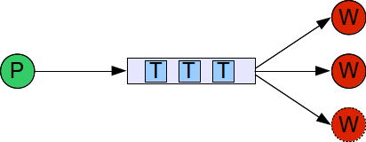

# sdfi
A Simple Distributed File Indexer

## Brief

`sdfi` is a CLI that finds the top 10 words across a collection of (text) documents.
Prepared as part of a development test for Rackspace Inc.

## Design

See `docs/specification.txt` for exact details and goals.

At a high level `sdfi` implements a simple task/event queue illustrated below.
The scheduler is the driver of the task queue by splitting up the text docs
into sizeable chunks before distributing each iterable chunk to an available worker.
The workers return with a tokenized list of words populating another growing list.
It then counts the occurrence of each word in the list.

The biggest performance and memory obstacle is handling the large list(s) of words.
An ideal method would continuously reduce the list while still keeping track of the
occurrence of each word, a feature that is left for the future...

I chose to work with Python 3 for this project in order to prototype fairly quickly.
In hindsight, a language with a better concurrency model may have offered easier
development (and less headaches).

## Requirements

Python 3.5.2

## Installation

### Unix

After cloning this repo and changing to the root directory of this project,
run `sudo python3 setup.py install`.

### Windows

## Tests

Run `python3 test.py`.

Additionally use `htop`, or a similar process viewer, to observe all the available cores
being used while executing `sdfi`.

## Usage

Type `sdfi --help` to see the full list of options.

## License

See MIT License.
